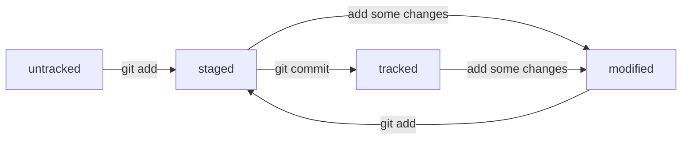

# Шпаргалка по работе с Git.   
## Установка и начало работы 
1. Перейдите на [сайт](https://git-scm.com/downloads) и скачайте Git для вашей ОС. 
2. Установите Git с помощью диалогового окна. 
3. Для работы с Git в консольном режиме запустите **Git bash**. 
## Навигация 
* Корневая директория - `/` 
* Домашняя директория - `~` 
* Вывести на экран список файлов текущей директории - `ls` 
  * Вывести на экран список всех файлов текущей директории (в том числе скрытых) - `ls -a` 
  * Вывести на экран список файлов с дополнительной информацией - `ls -l` 
* Перейти в нужную директорию - `cd имя_директории/имя_поддиректории/...` 
## Работа с файлами и папками 
* Создать файл - `touch fileName` 
* Просмотреть содержимое файла - `cat fileName` 
* Создать папку - `mkdir dirName` 
* Создать дерево папок - `mkdir -p dirOne/dirTwo/dirThree/...` 
* Удалить файл - `rm fileName` 
* Удалить пустую директорию `rmdir dirName` 
* Удалить директорию, содержащую файлы - `rm -r` 
* Копировать файл - `cp fileName directoryToStoreFile` 
* Переместить файл/папку - `mv fileOne, folderOne,... directoryToStoreFilesAndFolders` 
## Создание удалённого репозитория
1. Зарегистрироваться на сайте [GitHub]("https://github.com/") 
2. Создать репозиторий, присвоить ему имя, определить права доступа (*private, public*) 
## Создание локального репозитория
1. Создать папку с названием проекта, например `mkdir first-project` 
2. Переместиться в неё `cd first-project` 
3. Ввести в консоли команду `git init`.
4. Убедиться, что локальный репозиторий создан, можно по созданию папки **.git** внутри директории *first-project*. 
5. Введя команду `ls -a`, мы убедимся, что папки **.git** создана. 
6. Если репозиторий инициализирован по ошибке, то командой `rm -rf .git` мы удаляем его. 
## Генерация SSH ключей
* SSH (*secure shell protocol*) представляет из себя протокол для удалённого управления операционной системой 
* Для работы с этим протоколом необходимо сгенерировать пару ключей (*public - private*) 
* С помощью *private* ключа мы шифруем информацию. Данный ключ должен храниться только у нас. 
* С помощью *public* ключа мы расшифровывем информацию. Данным ключом можно делиться с теми, кто будет иметь в доступ к информации.
* Для генерации пары ключей воспользуемся утилитой **ssh-keygen**, предварительно перейдя в домашнюю директорию `cd ~`. 
* `ssh-keygen -t ed25519 -C "Электронная почта, к которой привязан аккаунт на GitHub` 
* *ed25519* - это алгоритм генерации ключей. Можно воспользоваться другим алгоритмом из числа тех, с которыми работает ОС. 
* После генерации ключей будет предложено ввести имя директории для их сохранения и пароль для последующего соединения с удалённым репозиторием. 
* Убедимся, что ключи сгенерированы. Командой `ls -la ~/.ssh` мы проверяем наличие не только самой папки *.ssh* (она скрыта, поэтому используется ключ **-a**), но и файлов внутри неё.
* Мы должны увидеть два файла вида *id_ed25519* и *id_ed25519.pub*.
## Передача публичного ssh-ключа.
1. На сайте GitHub в настройках своего аккаунта найти вкладку *Settings* и перейти на неё. 
2. В меню слева найти вкладку *SSH and GPG keys* и перейти на неё. 
3. В поле *SSH keys* добавить содержимое публичного ключа (*id_ed25519.pub*). 
## Привязка локального репозитория к удалённому
* Для того, чтобы загружать сохранённые файлы на удалённый репозиторий, нам необходимо связать локальный репозиторий с удалённым. 
  * Делается это с помощью команды `git remote add origin urlOfYourRemoteRepo` 
    * *origin* - имя удалённого репозитория по умолчанию. 
    * *urlOfYourRemoteRepo* - ссылка на удалённый репозиторий, которую мы можем найти в только что созданном удалённо репозитории. 
    * Например, `git@github.com:%ИМЯ_АККАУНТА%/%ИМЯ-ПРОЕКТА%.git` 
  * Проверяем, что оба репозитория связаны командой `git remote -v`. Должны наблюдать следующие две записи: 
    *origin    `git@github.com:%ИМЯ_АККАУНТА%/%ИМЯ-ПРОЕКТА%.git (fetch)` 
    *origin    `git@github.com:%ИМЯ_АККАУНТА%/%ИМЯ-ПРОЕКТА%.git (push)`  
## Сихронизируем локальный и удалённый репозитории
* Изначально Git помечает новые файлы в локальном репозитории как *untrackted* - неотслеживаемые, поэтому необходимо указать файлы, состояние которых будет отслеживаться. 
  * Команда `git add` не сохраняет файлы, а подготавливает их для дальнейшего сохранения. После выполнения `git add` Git начнёт отслеживать состояние указанных файлов. 
  * Командой `git add --all` мы добавим для отслеживания все файлы в данной директории. 
  * Так же мы можем добавлять файлы поимённо `git add fileNameOne fileNameTwo ...` 
* Командой `git status` мы проверяем состояние локального репозитория в данный момент: новые неотслеживаемые файлы, добавленные для отслеживания, сохранённые.  
* Подготовленные к сохранению файлы мы можем *закоммитить*, т.е. сохранить их текущее состояние в репозитории Git. 
  * Командой `git commit -m "*Message about commit*"' мы сохраняем состояние файлов в локальном репозитории. 
    * Флаг `-m` - *message*. По каждому коммиту необходимо написать сопровождающее сообщение о том, что было сделано, чтобы коллегам было проще понять суть изменений. 
* Если необходимо посмотреть историю коммитов, то командой `git log` мы можем увидеть все сделанные до этого момента коммиты. Самый верхний коммит - самый последний. 
* Для отправки изменённых файлов на удалённый репозиторий мы используем команду `git push`. 
  * `git push -u origin master` при первом коммите или `git push` для всех остальных. 
    * Флаг `-u` свяжет локальную ветку с одноимённой удалённой. 
    * *origin* - имя удаённого репозитория. 
    * *master* или *main* - название начальной ветки по умолчанию.  
## Hash коммита. Что? Для чего нужен?
* Хеш коммита (основной идентификатор коммита) представляет из себя набор чисел от 0 до 9 и букв A-F фиксированной длины, в котором зашифрована информация о коммите. 
  * Информация о коммисте содержит: имя автора, ссылка на предыдущий коммит, дату и время коммита, содержимое файлов в репозитории. 
  * Информация, указанная выше, преобразуется в хеш с помощью алгоритма SHA-1 (Secure Hash Algorithm). 
  * Алгоритм преобразования устроен таким образом, что изменение даже одного символа ведёт к сильному изменению в хеше. 
  * Существует таблица соответствий *хеш -> информация о коммите* Git хранит эту таблицу в скрытой папке **.git**.  
## История коммитов
 * Командой `git log` мы можем посмотреть историю коммитов в формате "самый верхний коммит - самый последний". 
   * Данная команда выводит следующую информацию: 
     * Хеш коммита; 
     * Автора коммита и его e-mail; 
     * Дату и время коммита; 
     * Краткое сообщение о том, что сделано в коммите.  
* Если коммитов много, то чтение такой информации становится неудобным. 
* Поэтому команда `git log --oneline` выводит список коммитов с самой нужной информацией: 
  * Сокращённый хеш коммита (но такой, чтобы в списке он был уникальным); 
  * Краткое сообщение о коммите; 
* Данный способ позвоялет легче ориентироваться в проектах с большим числом коммитов. 
## HEAD файл
* Информация о последнем коммите содержит так же фразу *HEAD->master*, которая содержим ссылку на этот коммит. 
* Файл HEAD хранится в скрытом каталоге *.git*. Командой `cd renoName` перейдём в необходимый репозиторий, а затем выведем на экран содержимое HEAD. 
* Команда `cat HEAD` выведет на экран *ref: refs/heads/master или main*. Это ссылка на служебный файл, заглянув в который, мы увидим хеш последнего коммита 
* Выполним `cat refs/heads/master или main`, получив, к примеру,  *e007f5035f113f9abca78fe2149c593959da5eb7*. 
* Файл HEAD обновляет ссылку каждый раз при появлении нового коммита. 
## Статусы файлов в Git
* Каждый файл, находящийся в репозитории, может иметь один (или несколько) статусов: 
  * Untracked (неотслеживаемый). Файл был создан, Git знает о его наличии, но не отслеживает его изменения. 
  * Staged (добавленный для отслеживания). Файл был добавлен с помощью команды `git add fileName`, и теперь Git следит за его состоянием. 
  * Tracked (отслеживаемый). Это файл, состояние которого было сохранено хот бы раз (*commit*). 
  * Modified (изменённый). Это добавленный для отслеживания файл, состояние которого было изменено (до или после коммита). 
* Замечания:
  * Любой *Staged* файл является и *Tracked* одновременно. 
  * *Modified* файлом может быть только файл, имеющий статус *Staged*.  
* Ниже приведена схема для более наглядного понимания: 

## Оформление сообщений к коммитам
* Сообщение о коммите пишется после флага `-m` в команде `git commit`. 
* Должно быть коротким, но информативным. Есть несколько подходов к оформлению таких сообщений. 
  * Название действия пишется через инфинитив (*доработать, поправить, изменить*) + над чем проводилось действие подробно; 
  * Название действия пишется через существительные (*доработки, поправка, изменение*) + над чем проводилось действие подробно; 
  * В больших компаниях в начале сообщения может указыватья буквенно-цифровой номер задачи `"LGS32: + что сделано"`. Так коллегам будет проще понять, к какой задаче относится коммит. 
  * Так же, можно указать номер задачи через её номер. Например `"Доработать метод по задаче #1"`. В этом случае GitHub свяжет коммит и выполняемую задачу. 
  * Можно обратиться к стандарту [Conventional Commits](https://www.conventionalcommits.org/ru/v1.0.0-beta.4/#%D1%81%D0%BF%D0%B5%D1%86%D0%B8%D1%84%D0%B8%D0%BA%D0%B0%D1%86%D0%B8%D1%8F), если работа ведётся с исходным кодом. 
## Исправление коммита
* Git предоставляет возможность исправить коммит, дополнив его файлами, которые мы забыли синхронизировать. 
* Командой `git commit --ammend` мы можем закоммитить недостающие файлы в послдений коммит. 
  * Флаг `--no-edit` говорит о том, что сообщение о коммите не меняется.
  * Если же есть необходимость изменить сообщение последнего коммита, то после команды `git commit --ammend -m "Новое сообщение"` мы дополняем коммит недостающими файлами + обновляем сообщение о коммите. 
* Если команда `git commit --amend` вызвана без флагов выше, то откроется текстовый редактор, который попросит написать сообщение о коммите. 
* **Важно отметить**, что команда `amend` работает только с последним коммитом. 
## Как "откатиться" назад
1. Если файл находится в статусе *modified*, и мы хотим отменить изменения в файле до предыдущего сохранённого состояния (последнее после команды `git add` или `git commit`), то командой `git restore fileName` мы вернём файл в предыдущее состояние. 
   * Если мы хотим отменить изменения во всех файлах, то командой `git restore .` мы вернём все *modified* файлы в предыдущее сохраннённое состояние. 
2. Если файл находится в *staging area*, и мы передумали его туда добавлять, то командой `git restore --staged fileName` выведет файл из *staging area* обратно в *untracked area*. 
   * Если мы передумали добавлять все файлы в *staging area*, то командой `git restore --staged ." выведет все файлы обратно в *untracked area*. 
3. Если мы хотим "откатиться" до какого-то конкретного коммита, удалив все коммиты после него, то командой `git reset --hard <hash коммита, на который "откатываемся">` перенесёт *HEAD* на указанный коммит, забыв о тех, что шли выше. 
## Просмотр изменений в файлах
* Команда `git diff` позволяет просмотреть разницу между последней закоммиченной версией файла и текущей изменённой.  	
  * Вывод изменений в файле содержит: 
    * Исходный файл (помечается знаками "---"), изменённый файл (помечается знаками "+++"). 
    * Добавленные и удалённые строки, которые отмечены знаками "+" и "-" соответственно. Так же они могут быть окрашены в зелёный и красный цвета соответственно. 
    * Количество строк, попавших в вывод. Строка вида `@@ -1,2 +1,2 @@` сообщает о том, что в исходном (`-`) и текущем (`+`) файлах выведены по две строки начиная с первой. 
* По умолчанию команда `git diff` не показывает изменения в *staged* файлах, только в *modified*. Если изменения всё же необходимо просмотреть, то `git diff --staged` выведет изменения между *staged* файлом и закоммиченным. 
## Добавление строки в файл
* Строку в файл можно добавить через команду `echo`, которая выводит на экран всё, что поступает ей на вход, и символы перенаправления вывода `>>`. 
  * `echo "Useless string" >> file.txt` добавит строку *"Useless string"* в файл *file.txt*. 
* В случае использования `>` содержимое файла будет сначала удалено, а затем добавлена новая строка. 
  * `echo "Useless string" > file.txt` удалит содержимое файла *file.txt*, а затем добавит строку *"Useless string"*. 
## Игнорирование файлов в Git
* Часто в репозитории есть файлы, отслеживание и добавление которых не требуется. С помощью созданного в репозитории файла `.gitignore` мы можем перечислить те файлы, которые будут 
проигнорированы. 
* Можно перечислять файлы как поимённо по одному на строку, так и их шаблоны, что значительно упростит процесс составления `.gitignore` файла. 
* Правила, перечисленные в `.gitignore`, применяются только к *untracked* Файлам. Если файлы уже попали в *staging area*, то правила на них не распространяются. 
* Некоторые правила составления `.gitignore` файлов: 
  * Если необходимо проигнорировать все файлы с названием *debug.info* во всех папках и подпапках репозитория, то мы пишем название файла и его расширение. 
    * Если необходимо игнорировать файлы с именем *debug* независимо от расширения, то мы просто пишем его имя. 
  * Для игнорирования файлов с конкретным расширением, используется `*`. Например, `*.jpeg` проигнорирует все файлы с расширением *.jpeg* во всём репозитории. 
  * Так же символ `*` может использоваться и для обозначения количества папок (не более одной). Например, `folder/*/bump.txt` сообщит Git о необходимости проигнорировать файл 
*bump.txt*, который располагается в любой из сабдиректорий `folder`. (`folder/temp/bump.txt`, `folder/subf/bump.txt`. **НО** `folder/one/two/bump.txt` правилу не подчиняется. 
  * Для того, чтобы проигнорировать файл в любой сабдиректории, как бы 
глубоко в репозитории он не лежал, используется символ `**`. Например, `user/**/bump.txt` проигнорирует файл 
*bump.txt* как бы глубоко в поддиректориях он не находился. 
  * Правила `*` и `**` работают так же и для папок. 
  * Для формирования исключения из правила, мы ставим восклицательный знак. Например, файл `!car.jpeg` не будет проигнорирован, не смотря на то, что все остальные файлы с таким 
расширением игнорируются. 
  * Символом `[]` мы обозначаем вариативность части имени файла. Например `file[0-2].txt` сообщает Git о том, что файлы *file0.txt, file1.txt, file2.txt* необходимо 
проигнорировать. 
  * Символ `?` обозначает любой одинарный символ. С помощью него мы так же указываем на вариативность имени файла. Например `file?.txt` сообщит Git о необходимости проигнорировать все 
файлы, в имени которых есть *file + один символ + расширение .txt*. 
  * Слеш `/` относится к папкам. Если шаблон в *.gitignore* начинается с 
косой черты, то Git проигнорирует файлы или каталоги только в корневой 
директории. Например, `/file.txt` будет игнорироваться только в корневой 
директории, папка `build/` (но не файл с таким же именем) так же будет 
игнорироваться только в корневой директории. 
* Игнорируемые файлы не отображаются при выводе команды `git status`, но 
если их всё же необходимо просмотреть, то ключ `--ingored` даёт такую 
возможность. `git status --ignored` выведет все исключённые файлы и 
директории. 
* **Сам же файл .gitignore необходимо предварительно закоммитить, чтобы 
от не отображался в выводе. 
 
